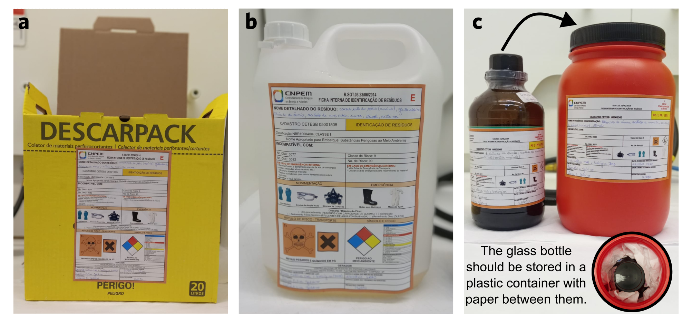
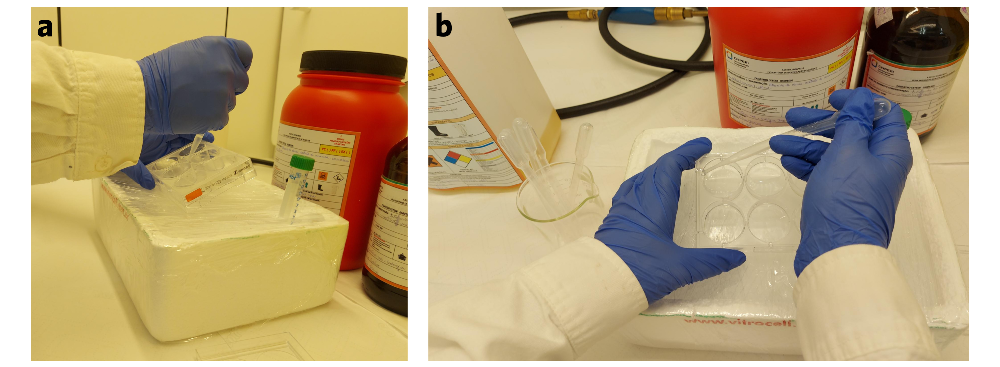
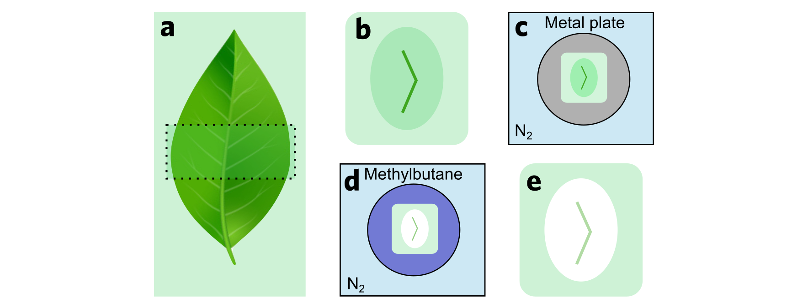
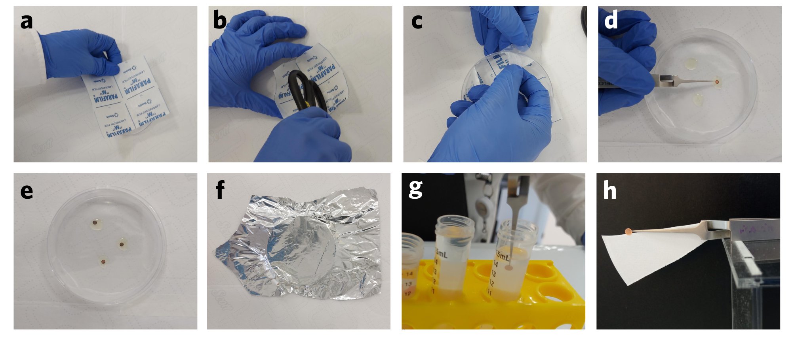
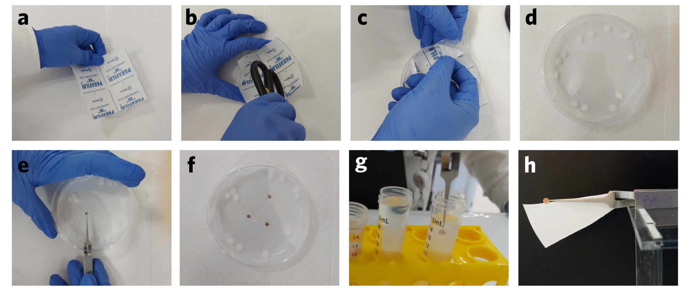
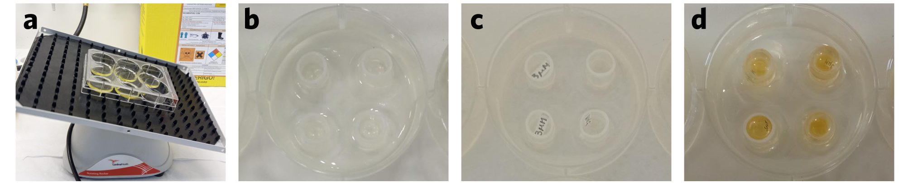
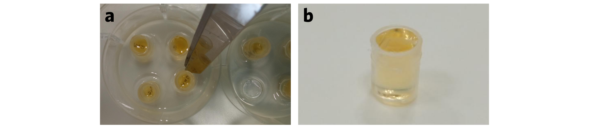

::: {style="text-align: justify"}
The structure of .....
:::

# Cover {.unnumbered}

# Summary {.unnumbered}

# Introduction {.unnumbered}

# Document structure {.unnumbered}

# General {.unnumbered}

# Security cautions {#Security}

**Reagents and solutions.** Some of the reagents used in the preparation of the fixation solution and/or the buffers are potentially hazardous. Formaldehyde, for example, according to Regulation (EC) No 1272/2008 is a flammable liquid (category 3), presents acute toxicity category 3 (dermal and oral) and also is a carcinogenicity compound (category 1B). Other buffers/solutions composition, like in sodium cacodylate buffer (recommended to dilute glutaraldehyde for fixation solution) include heavy metals.Most of the reagents used in the preparation of biological samples are HIGHLY TOXIC. For this reason, rigorous safety procedures must be adopted for any procedure involving the handling of these reagents or resulting solutions. Weighing and handling of the reagents and resulting solutions should be done in a fume hood with the surface lined with a layer of plastic film and two layers of paper towels (Figure 1a). The balance placed on the fume hood lining should have its interior and display covered with two sheets of paper and plastic film, respectively (Figure 1a and 1b). This procedure prevents the dispersion of toxic chemicals and, consequently, contamination of the environment, the handler, and other laboratory users.

Spatulas and glassware used during the preparation and storage of solutions with sodium cacodylate, uranyl acetate, or lead nitrate should be washed with water in the fume hood using a wash bottle, and the generated residue should be discarded in a plastic waste container. They should be stored separately from other commonly used laboratory materials. When necessary, adjusting the solution's pH should also be performed using a pH meter inside the fume hood with the specifications mentioned above.

**Heavy metals waste.**The waste should be separated into three types of exclusive disposals:

* Solid Waste: All types of solid waste generated during any handling of toxic reagents and their solutions should be discarded in puncture-resistant collection boxes  (kind Descarpack^®^) (Figure 3a), including needles, syringes, Falcon tubes, glass and plastic pipettes, gloves, plastic film, and paper. The paper and plastic film used to line the fume hood should also be disposed of in this box. The box should be labeled with a Heavy Metal Chemical Waste Identification Label.

* Liquid Waste: Liquid waste should be disposed of in two types of containers, according to the classification below:

  * 5L plastic drum (Figure 3b): General liquid waste, except those containing osmium and uranyl acetate. The drum should be labeled with a Heavy Metal Chemical Waste Identification Label.

  * 1L glass bottle: Liquid waste containing osmium tetroxide and uranyl acetate. It is recommended to store the glass bottle within a plastic container (Figure 3c), and both should be labeled with a Heavy Metal Chemical Waste Identification Label.
  
```{r echo=FALSE, fig.cap= 'Disposals: a) Descarpack-type box for the disposal of solid materials used in this protocol. b) 5L drum for the disposal of liquid materials. c) Glass bottle for the disposal of liquid materials containing osmium tetroxide and uranyl acetate. The glass bottle should be stored in a plastic container with paper between the walls of the containers.'}

```
  
**Laboratory glassware and accessories.** Any lab glassware which to be used to do or manipulate heavy metals should be exclusive. In some cases, it is necessary to work only with disposable material (working with osmium, for example).

**Biological material.** It's necessary be careful to the kind of cell used in the study. Working in sterile conditions and biological security prevents the contamination of the cell line, but is specially important when the sample is intrinsically contaminated (infected cells, for example). For this, all the good biosafety practices should be follow: working in flow hood (clean and sterile with UV lamp), lab gloves, lab coat, and others Personal Protective Equipment (PPE), sterile material (glassware, lab accessories). Then, when the procedures with sample *in vivo* happened it is need to have an inactivation step. In a general way the chemical fixation already allows the inactivation of the sample.

# Overview of biological sample preparation

## Buffers

Biological samples require controlled pH and osmolality to maintain their structure and enable proper functioning. Therefore, during sample cultivation and the initial steps of sample processing, it is necessary to use buffer systems with osmotic concentrations that are compatible with the cells.

**Phosphate buffer**
The phosphate buffer is a safe option with a buffering capacity close to pH 7.4. Nonetheless, it is not advisable for protocols involving calcium due to the risk of phosphate precipitation in its presence. Ensuring regular preparation of this buffer is essential to prevent any contamination.

**Cacodylate buffer**
The cacodylate buffer is toxic as it contains arsenic. However, it has a buffer capacity around pH 7.4 and does not precipitate in the presence of calcium and magnesium ions.

## Fixation

Fixation is performed to stabilize cellular structures for sample processing. Initially, it should be carried out at room temperature to avoid temperature shock to the sample. The composition of the fixative solution depends on the type of biological material and its size. Inadequate concentration can lead to modifications in sample composition and structure.

For plant samples, fixation should be conducted under vacuum as these materials contain CO~2~, which needs to be removed to facilitate fixative penetration. 

Fixation can be achieved chemically or physically, as described below:

**Chemical fixation**

* Glutaraldehyde and paraformaldehyde: These are non-coagulant fixatives that interact with proteins, forming cross-links. Generally, they yield better results compared to alcohols and acetone. Paraformaldehyde has a higher penetration capacity in samples compared to glutaraldehyde, attributed to their differences in size. However, glutaraldehyde forms more cross-links than formaldehyde.

* Ethanol, methanol, and acetone: These fixatives function as coagulants, precipitating proteins and altering their conformation. These reagents do not fix lipids, and in some cases, they can wash lipids out of the sample.

**Post-fixation**

The post-fixation solution is composed of osmium tetroxide. This reagent reacts with unsaturated lipids, resulting in the reduction of osmium and causing the solution to darken. It is exclusively used in protocols for transmission electron microscopy.

**Cryo-fixation**

If available, cryo-fixation is the optimal choice to prevent artifacts in the sample. It involves the rapid cooling of the sample at -180 °C to ensure instantaneous preservation. This procedure allow to study even those process that involves rapid structural changes. Care must be taken to avoid the formation of ice crystals during the preparation.

Typically, the sample is washed with an ammonium acetate buffer and then rapidly frozen by plunging it into liquid ethane that is cooled by liquid nitrogen. This method, known as plunge freezing, is commonly used for thin samples. For thicker samples, an alternative technique called high-pressure freezing is employed. In high-pressure freezing, the sample is subjected to a high pressure of 2100 bar, and the freezing occurs with slowly formation of crystalline ice.

After freezing, the sample can be directly analyzed using cryo-analysis techniques that examine the entire sample. In other cases, if the sample needs to be embedded in a resin block for sectioning, a freeze substitution protocol is followed after freezing.


## Contrasting

Certain compounds are utilized to boost the contrast of particular biological molecule groups. Uranium and lead are the most frequently employed stains for this purpose. Typically, uranium is applied in the form of uranyl acetate, amplifying the contrast of lipids and proteins. Conversely, lead is commonly employed in the form of lead citrate to heighten the contrast of proteins and glycogens.

## Resins


## Substrates {#Substrates}

There are various types of substrates available for preparing biological samples.

**Silicon nitride window:** This is the most commonly used substrate for preparing biological samples for X-ray analysis due to its high x-ray transmission. It is especially used at beamlines such as CARNAÚBA and CATERETÊ at Sirius.

**Gold substrate:** This substrate is utilized in analyses requiring the reflection of incident radiation, such as S-SNOM, micro-FTIR in reflectance mode, and ATR-FTIR, all performed at the IMBUIA beamline at Sirius.

**Glass substrates:** This substrate is utilized in sample preparation for Scanning electron microscopy.

**Silicon nitride substrate:** 

**Calcium fluoride substrate:** This substrate is utilized in analyses that require the transmission of incident radiation through the sample. It is employed in characterization methods, such as FTIR and micro-FTIR transmission, conducted at the IMBUIA beamline at Sirius.

**Barium fluoride substrate:** This substrate finds application in analyses involving the transmission of incident radiation through the sample, and it is suitable for characterization methods like FTIR and micro-FTIR transmission at the IMBUIA beamline at Sirius. However, for biological samples, only deposition is carried out due to the toxicity of barium fluoride for cultivation.

## Sample drying

Generally, biological sample analysis requires dried samples, although in some cases, frozen samples can be analyzed. Therefore, it is necessary to dry these biological samples in a manner that does not affect their structure.

**Air drying:**  It is the simplest method to dry the sample by leaving it in a desiccator. However, this methodology causes the most damage to the biological structure.

**Critical point dryer:** This methodology better preserves the biological structure. However, depending on the characterization goals, the substitution of ethanol with CO2 may lead to the washing away of certain compounds. As a result, it is not the most suitable method for samples intended for characterization by FTIR and fluorescence at the IMBUIA and CARNAUBA beamlines, respectively.

**Plunge freezing (PF) and freeze drying:** For samples that have been frozen, the drying process is performed using a freeze dryer. This procedure is based on the sublimation of the solvent, which transforms it directly from the solid to the gas state.

References for the overview:
Chemical and Physical Fixation of Cells and Tissues: An Overview


# X-ray synchrotron imaging
```{=html}
<style>
body {text-align: justify}
</style>
```

The seminal discovery of X-rays by Wilhelm Conrad Röntgenon on the nineteenth century had a greater impact on science and technology. There were contributions in a lot os fields, for example: material sciences, medicine and biological images. Research with X-rays experienced a stunning boost after the discovery
of synchrotron radiation in 1946. At a synchrotron facility, electrons traveling near the speed of light are maintained in a storage ring by electromagnetic field. When the electrons are accelerated by changing the direction of travel, X-rays are emitted. [@Jaeschke2021]

Imaging is the oldest application of X-rays since their discovery. The edge-enhancement effect is one of the key features of synchrotron imaging because it improves the sensitivity of imaging structures with only small density differences and absorption contrast.Compared with the laboratory-based X-ray sources, synchrotrons have the advantages of a wide energy range, a high photon flux, and good beam coherence. As a result this advantages permits faster acquisition of a large range of samples with different phase techniques e.g. X-ray nanoscopy or Coherent and Time-resolsed X-ray Scattering. [@Westneat2008]

Side by side with the acquisition, the sample preparation protocols have a key importance in the technique. For a scientific hypothesis involving any specific chemical element, it will need a free-protocol of elements with the same or close excitation energy, if it uses any X-ray fluorescence technique, for example. If it chose to preserve some structure in biological samples, it would be necessary look at the fixation protocol  (e.g. chemical, cryo-fixation or freeze-substitution) and the drying process (e.g. air-drying, freeze-drying or work with frozen-hydrated samples).

This chapter presents routine preparation protocols for samples that will be analyzed by synchrotron imaging techniques; check it out!

## Animal adherent cells - Protocol 1

Adherent cells can adapt their cytoskeleton in response to elastic properties modifications in the extracellular matrix. This kind of cell, has an anchorage-dependency and is usually cultivate in a suitable substrate that provides specific conditions to the cells growth and spread. In the context of the animal cells, they can have different water composition and be able to growth better in some substrates. This properties are going to conduce the better technique to prepare the samples for x-ray microscopy data acquisition. See below the indicated preparation for these samples. [@Tsiapalis2019]

### Chemical fixation

This is the commonest technique which is used to prepare adherent cells for x-ray microscopy. In this case, is going to have chemical reticulation between a chosen compound and the samples. It can happen by chemical bond (covalent) or intermolecular forces (Van der Waalls, dipole-dipole or hydrogen bond). The method can be divided in five steps: a) sample pre-preparation (membranes, wash buffer and cell plating buffer), b) plating of cells, c) fixation of cells, d) dehydration and e) sample mouting and imaging. Next, the materials and the specific procedures were presented.Also, check it out the general/safety flowchart. 

```{r echo=FALSE, fig.cap= 'Chemical fixation in animal adherent cells - general and safety flowchart'}
knitr::include_graphics(rep("images/Figure 1_Flowchart_overview.png", 1))
```

#### Materials {.unnumbered}

-   Wash buffer (like tris-glucose, PIPES-sucrose, etc);
-   Silicon nitride (SiN~3~) membrane;
-   Cell-plating buffer (like D-PBS);
-   Tweezers;
-   Ultra-pure water;
-   Ethanol (analytical grade) - absolute and 70% solution;
-   Tape;
-   Petri dishes;
-   Poly-L-lysine 0.01%;
-   Flow hood with UV lamp;
-   Cells incubator;
-   Invert light microscope;
-   Fixation solution (it can use paraformaldehyde, formaldehyde, glutaraldehyde, etc);
-   Micropipettes;
-   Lint-free towels;
-   Rubber grid mat (kind used in electron microscopy);
-   Glass slide;
-   Glue (like nail polish);
-   Aluminum holder (beamline).

#### Procedures {.unnumbered}

**1. Buffers.** First of all, it start preparing the cell-plating buffer which depends the properties of the cell line in work, so check it out the specific literature and the seller instructions (for commercial cells line). Choose and prepare the wash buffer (Tris-glucose or PIPES-sucrose, for example) according with the samples and the experiment. It's recommended around 30mL per sample in this protocol. The composition of the buffer will may interfere the results at the beamline experiment. So, contact the LNLS team with this information.

**2. Fixation solution.** Select the most adequate fixation solution for the sample based on the kind of reticulation expected. Fixation solutions with glutaraldehyde, for example, would do cross-link by covalent bond; formaldehyde in other hand is going to do reticulation only by intermolecular forces. The fixation solution usually starts by diluting of a commercial standard of the fixation compound in a buffer, to obtain the work concentration. Next, the pH is going to be adjusted for the work scale. Additional compounds would be introduce in the solution; it depends to the objectives. Paraformaldehyde, for example, is dilute in D-PBS buffer to concentration of 4% and the pH is adjust to 7.4 with acetic acid.

**3. Silicon nitride membranes.** In this method, the samples are put in a silicon nitride membrane, which will be used at the beamline. There are different membrane thickness, like 50, 100 or 200nm. Consider all the procedures of the experimental mapping before choose the best thickness to your sample. The membranes usually are store in a capsule. First, open this capsule flatting with the fingers. Use thin tweezers to remove, carefully, the membrane from the capsule. Wash the membrane with ultra-pure water to 5min. Afterwards, wash with 70% ethanol to 2min and then with 100% ethanol to 2min and let it dry. In a Petri dish, on the bottom, adhere gently the membrane using a tape. Put the dish in a flow hood and turn on the UV lamp to 1 hour. Next, the membrane is going to be pre-coated. For that, keeping the sterile conditions, coat the sample with 10μL of Poly-L-lysine 0.01% and incubate for 1 hour, 37ºC, with the UV lamp turned on in the flow hood. The membranes is going to be sterile and coated.

**4. Plating of cells.** Start passing the adherent cell line that was chosen (trypsinizing, scraping). Next, do the other necessary operations to be able to inoculate the cells. In the sterile and coated membranes at the flow hood gently add 10mL (proportion for 100mm Petri dish) of the adequate culture media for the cells. Cover the membranes with the media. Inoculate the prepared cell line in the mounted membranes. After that, incubate the dishes in the humidified incubator at 37ºC, with 5% CO~2~ to 24-72 hours. Using an invert microscope, monitor the cell confluence to 50-70%. Keep observing, occasionally, until the desired confluence.

**5. Fixation of the cells.** When/ if the cells adequately grown remove the media by gently aspiration. Next, rinse the membranes with the solvent used to prepare the fixation solution. After that, cover the membrane with this solution. Hold 20 minutes and then remove the liquid. Cover the membranes with the chosen wash buffer,and immediately afterward remove the liquid. Add the wash buffer one more time. Carefully, tweeze the fixed tape around the membrane. Retrieve the membranes with some wash buffer. Then, when it is floating use the tweezers to pick up the membrane. Using a lint-free towels (like Kimwipes^®^), daub any excess of PIPES-sucrose from the edge of the membrane. Place the membrane in a rubber grid mat (kind used in electron microscopy) and let it dry.

**6. Sample mounting and imaging.** If the sample dry completely, start mounting the membrane to the synchrotron facility. Be careful and fix the membrane in a glass slide from the grid mat, using a tape. Then, fix the slide on the bottom of a Petri dish. Shut down the dish with tape. Transport the packed dish to the synchrotron. In the beamline supporting remove the tape over the membrane with the tweezers, carefully. Then use a glue (like nail polish) to adhere the membrane on the beamline aluminum holder. Insert the sample in the x-ray microscope and use the specific beamline software to set up: area to scan, chosen resolution, dwell time and follow to acquire the scan. The raster-scan image is going be submitted for data analysis, which permits to get the reconstructed image.

\cite{Tsiapalis2019} 
\cite{Jaeschke2021}
\cite{Westneat2008}
\cite{Finney2015}

## Animal adherent cells - Protocol 2 - Culture on substrate

* In this method, the cells are cultivated on a silicon nitride membrane or any other substrate. 

* The membranes usually are store in a capsule. First, open this capsule flatting with the fingers. Use thin tweezers to remove, carefully, the membrane from the capsule. 

* Wash the membrane or the substrates with 70% ethanol and then let it dry. 

* In a 6 well plate, on the bottom, adhere gently the membrane using a tape. Put the dish in a flow hood and turn on the UV lamp to 1 hour. 

* In the sterile membranes/substrates at the flow hood gently add the cell suspention in a concenration about 5000 cells/well.Homogeneize the cells in the plate. After that, incubate the plate in the humidified incubator at 37ºC, with 5% CO~2~ to 24-72 hours. Using an invert microscope, monitor the cell confluence to 50-70%. Keep observing, occasionally, until the desired confluence.

* When/ if the cells adequately grown remove the media by gently aspiration and wash the cells with media withou FBS. Avoid using phosphate buffer in this sample preparation.

The cacodylate buffer used to prepare sample for the Carnaúba beamline typically contain CaCl2 in most cases, although it is not necessary for sample preparation for the Cateretê beamline.

**Reagents:**

* 0.2 M cacodylate buffer containing 6 mM CaCl~2~ (Section \@ref(Cacocom))

* 0.1 M cacodylate buffer containing 3 mM CaCl~2~

* 25% glutaraldehyde

* Ethanol

**Caution:** The following steps should be performed in a lab hood, following the previously discussed in Section \@ref(Security). When removing or adding solutions to the well, use the wall of the well to prevent the detachment of the sample from the cover slips. Add the solution with a gentle flow.

```{r echo=FALSE, fig.cap= 'a) Removal of solutions from the culture plate containing the adhered sample at the bottom of the well using a Pasteur pipette and tilting the plate so that the removal is performed slowly along the lower edge of the well.b) Addition of solution to the culture plate containing the adhered sample at the bottom of the well by slowly pouring the solution along the side edge.'}

```

* Fixation: Immediately prior to the commencement of fixation, follow the protocol outlined in Section \@ref(gluta) to prepare the fixation solution containing 2.5% glutaraldehyde in a 0.1 M cacodylate buffer containing 3 mM CaCl~2~. Carefully aspirate the cell culture media from the well and add an appropriate amount of fixation solution at room temperature to ensure that the cells remain submerged (approximately 1.5 mL). Keep the cells at room temperature for 5 minutes, and then incubate them at 4°C for 1 hour or overnight.

* Turn on the ice machine and prepare the dehydration solutions as described in Section \@ref(Dehydration).

* Ice: As the fixation process nears completion, prepare a foam box and carefully fill it with well-packaged ice. Cover the box with PVC film to maintain insulation. Ensure that the sample remains in contact with the ice throughout the next steps. Regularly check and replenish the ice as needed to ensure proper cooling.

* Washing: Gently wash the samples three times with 0.1 M cacodylate buffer containing 3 mM CaCl~2~, allowing each wash to proceed for 5 minutes. Dispose of the waste in the designated plastic disposal container.

* Dehydration: Remove the buffer from the samples and proceed with the dehydration process. Keep the samples in each ethanol solution for 10 minutes, starting from 15% and increasing in increments (30%, 50%, 70%, 80%, 90%, and two times 100%), all of them in an ice bath. Dispose of the waste in the designated glass disposal container. Store the samples in cold ethanol and proceed with the recommended steps for sample drying, either through Air drying (Section \@ref(Air)) or Critical point drying (Section \@ref(CPD)). Then, follow Section x for Carnaúba characterization and Section x for Cateretê analysis.


## Animal adherent cells - Protocol 3 - Resin embedded

Wash cover slips twice by submerging them in 70% ethanol. Place one cover slip per well in a 6-well plate. Ensure that only one cover slip is placed in each well, as having more than one cover slip per well can affect the final detachment of cells from the glass. Allow sufficient time for all the ethanol to evaporate completely before seeding the cells. Dispense the cells in the wells and allow they to grow for at least 24h.

Before beginning the fixation process, ensure that the cell confluence reaches an appropriate density to cover the slide without causing overlapping of cell structures. Avoid using phosphate buffer in this sample preparation. Wash the cells with cell culture media without FBS before fixation. The cacodylate buffer used to prepare sample for the Carnaúba beamline typically contain CaCl2 in most cases, although it is not necessary for sample preparation for the Cateretê beamline.

**Reagents:**

* 0.2 M cacodylate buffer containing 6 mM CaCl~2~ (Section \@ref(Cacocom))

* 0.1 M cacodylate buffer containing 3 mM CaCl~2~

* 25% glutaraldehyde

* Ethanol

* Reagents for resin EmBed 812

**Caution:** The following steps should be performed in a lab hood, following the previously discussed in Section \@ref(Security). When removing or adding solutions to the well, use the wall of the well to prevent the detachment of the sample from the cover slips. Add the solution with a gentle flow.

* Fixation: Immediately prior to the commencement of fixation, follow the protocol outlined in Section \@ref(gluta) to prepare the fixation solution containing 2.5% glutaraldehyde in a 0.1 M cacodylate buffer containing 3 mM CaCl~2~. Carefully aspirate the cell culture media from the well and add an appropriate amount of fixation solution at room temperature to ensure that the cells remain submerged (approximately 1.5 mL). Keep the cells at room temperature for 5 minutes, and then incubate them at 4°C for 1 hour or overnight.

* Turn on the ice machine and prepare the dehydration solutions as described in Section \@ref(Dehydration).

* Ice: As the fixation process nears completion, prepare a foam box and carefully fill it with well-packaged ice. Cover the box with PVC film to maintain insulation. Ensure that the sample remains in contact with the ice throughout the next steps. Regularly check and replenish the ice as needed to ensure proper cooling.

* Washing: Gently wash the samples three times with 0.1 M cacodylate buffer containing 3 mM CaCl~2~, allowing each wash to proceed for 5 minutes. Dispose of the waste in the designated plastic disposal container.

* Remove the reagents for resin production from the refrigerator.

* Prepare the resin following the protocol described in Section \@ref(Resin).

* Dehydration: Remove the buffer from the samples and proceed with the dehydration process. Keep the samples in each ethanol solution for 10 minutes, starting from 15% and increasing in increments (30%, 50%, 70%, 80%, 90%, and two times 100%), all of them in an ice bath. Then, remove the plate from the ice bath and replace the ethanol with 100% ethanol at room temperature. Dispose of the waste in the designated glass disposal container.

* Embedding: follow the procedure described in Section \@ref(Embedding1)

* Utilizing a light microscope, choose the best blocks to proceed with microtomy 
* Section the sample in a microtome with a thickness ranging from 10 to 20 μm Section \@ref(sectioning3).

* Utilize laser microdissection to select a cell and cut an area measuring 25 μm x 25 μm. 

* Transfer the cuts to the silicon nitride membranes using an eyelash.

Follow Section x for Carnaúba characterization and Section x for Cateretê analysis.

## Leaves

#### Materials {.unnumbered}


-   Tweezer;
-   Ultra-pure water;
-   Coverslip
-   Blade
-   Capsule (as storing medicines)
-   Tissue-Tek OCT
-   Metal plate
-   Liquid nitrogen
-   Beaker
-   Methylbutane
-   Foam cryo cups

#### Procedures {.unnumbered}

Remove the leaf from the plant just moments before beginning the sample preparation. If necessary, wash the leaf with water to remove any dust particles. Position the leaf on a new coverslip and carefully cut out the area of interest using a fresh blade.

Prepare a small capsule, similar to those used for storing medicines, by placing a layer of Tissue-Tek OCT at the bottom. Transfer the cut leaf into the capsule, ensuring it remains in a vertical position using a tweezer to hold it steady. Place the bottom of the capsule in contact with a metal surface cooled to N2 temperature, ensuring the leaf remains straight while the Tissue-Tek OCT freezes.

Fill the capsule with more Tissue-Tek OCT, then transfer the capsule to a beaker containing methylbutane, which should be under stirring and in contact with N2. The methylbutane should reach a state between transparent and opaque.

Once the Tissue-Tek OCT has completely frozen, remove the capsule from the methylbutane and place it in a cryostat set to -20°C. Keep the capsule inside the cryostat until ready for cryosectioning.

```{r echo=FALSE, fig.cap= 'Preparation of leaf for imaging: a) Cut the leaf on a new coverslip with a fresh blade. b) Transfer the leaf section to a capsule containing some Tissue-Tek OCT and align the leaf to ensure it remains straight. c) Place the capsule in contact with a metal at N2 temperature, ensuring the leaf remains straight. Fill the capsule with Tissue-Tek OCT. d) Transfer the capsule to a beaker containing methylbutane under stirring and in contact with N2. e) Remove the capsule from the methylbutane and place it in a cryostat at -20°C.'}

```

In the cryostat, section the leaves with a thickness of 35 μm at -20°C. Collect the sections with the substrate mounted on the beamline pin and transfer them to liquid nitrogen.


# Synchrotron infrared imaging

The goal of synchrotron infrared imaging is centered on the biochemical characterization of samples. The IR spectra of phospholipids, proteins, nucleic acids, and carbohydrates can be acquired and identified considering the "fingerprint region" of these compounds.

Synchrotron infrared imaging can be conducted through reflectance or transmittance of radiation. In reflectance mode, IR light reaches the sample, reflects off the substrate, passes back through the sample, and returns to the objective. In transmission mode, the IR light passes through the sample and is collected on the other side. Identifying the mode of analysis is the initial step in determining the substrate used for sample preparation. As mentioned in Section \@ref(Substrates), gold or silicon nitride substrates are recommended for reflectance analysis, while barium fluoride or calcium fluoride should be used for transmittance analysis. In both cases, thin sectioning (5-10 µm) should be performed on big samples to enable the transmission or reflectance of light.

For naturally small samples, such as bacteria and mammalian cells, sample preparation includes directly depositing the sample onto the substrate after fixation and dehydration or cultivating it directly on the substrates. In the case of thicker samples, like tissues, the sample can be embedded in a material that does not have IR absorption overlapping with the sample but aids in maintaining the structure during sectioning.

Table x. "Fingerprint region" of biomolecules and of other compounds used in the sample preparation.


 Compound          vibration           wavenumber / cm-1   
----------------- -------------------- ------------------------- 
Lipid               C-H (CH3 and CH2)   2800-3000                
Lipid               C=O                 1736                    
Protein             C=0                 1600-1700                  
Protein             C-N                 1500-1560
Nucleic acid        PO2-                1224
Nucleic acid        PO2-                1087
Carbohydrate        O-H                 3400                 
Carbohydrate        C-O                 800-1300
Paraffin            C-H                 2800-3000


## Protocols for sample preparation

### Adherent mammalian cells

Wash the substrates twice by submerging them in 70% ethanol. Place around four substrates per well in a 6-well plate. Allow sufficient time for all the ethanol to evaporate completely before seeding the cells. Dispense the cells in the wells and allow they to grow for at least 24h.

Before initiate the fixation, ensure that the cell confluence reaches a suitable density to cover the substrates without causing overlapping of cell structures. Avoid using phosphate buffer and calcium chloride in this sample preparation.

**Reagents:**

* 0.2 M cacodylate buffer (Section \@ref(Cacosem))

* 0.1 M cacodylate buffer

* 25% glutaraldehyde

* Ethanol

* Milli-q water

**Caution:** The following steps should be performed in a lab hood, following the previously discussed in Section \@ref(Security). When removing or adding solutions to the well, use the wall of the well to prevent the detachment of the sample from the substrates. Add the solution with a gentle flow.

* Fixation: Immediately prior to the commencement of fixation, follow the protocol outlined in Section \@ref(gluta) to prepare the fixation solution containing 2.5% glutaraldehyde in a 0.1 M cacodylate buffer. Carefully aspirate the cell culture media from the well and add an appropriate amount of fixation solution at room temperature to ensure that the cells remain submerged (approximately 1.5 mL). Keep the cells at room temperature for 5 minutes, and then incubate them at 4°C for 1 hour or overnight.

* Turn on the ice machine and prepare the dehydration solutions as described in Section \@ref(Dehydration).

* Ice: As the fixation process nears completion, prepare a foam box and carefully fill it with well-packaged ice. Cover the box with PVC film to maintain insulation. Ensure that the sample remains in contact with the ice throughout the next steps. Regularly check and replenish the ice as needed to ensure proper cooling.

* Washing: Gently wash the samples three times with 0.1 M cacodylate buffer, allowing each wash to proceed for 5 minutes. Dispose of the waste in the designated plastic disposal container.

* Dehydration: Extract the buffer from the samples and initiate the dehydration process. Immerse the samples in sequential ethanol solutions for a duration of 10 minutes each. Begin with a 15% ethanol solution and gradually increase in increments (30%, 50%, 70%, 80%, 90%, and two times 100%), all while maintaining an ice bath. Then, proceed with the recommended steps for sample drying through Air drying (Section \@ref(Air)). Dispose of any waste materials in the designated plastic disposal container.

* Turn off the ice machine.

### Bacteria

The utilization of poly-L-lysine, recommended for promoting bacterial adherence to substrates, is limited in sample preparation for synchrotron infrared imaging due to its interference with the spectra of biological compounds. Therefore, the bacterial sample preparation for this technique involves the fixation and dehydration of bacteria in suspension, followed by deposition onto the substrate.

It is advised to refrain from using phosphate buffer and calcium chloride in this particular sample preparation.

**Reagents:**

* 0.2 M cacodylate buffer (Section \@ref(Cacosem))

* 0.1 M cacodylate buffer

* 25% glutaraldehyde

* Ethanol

* Milli-q water

**Caution:** The following steps should be performed in a lab hood, following the previously discussed in Section \@ref(Security). 
The exchange of solutions is accomplished by centrifuging the bacterial suspension (330 g, 5 min, 4°C), removing the supernatant, and resuspending the bacteria in a fresh solution.

* Fixation: Immediately prior to the commencement of fixation, follow the protocol outlined in Section \@ref(gluta) to prepare the fixation solution containing 3.0% glutaraldehyde in a 0.1 M cacodylate buffer. Centrifuge the bacterial suspension at 330 g for 5 minutes, carefully aspirate the supernatant, and add an appropriate volume of fixation solution at room temperature to ensure the bacteria remain submerged. Allow the bacteria to stand at room temperature for 5 minutes, followed by an incubation period at 4°C for 1 hour or overnight.

* Turn on the ice machine and prepare the dehydration solutions as described in Section \@ref(Dehydration).

* Ice: As the fixation process nears completion, prepare a foam box and carefully fill it with well-packaged ice. Cover the box with PVC film to maintain insulation. Ensure that the sample remains in contact with the ice throughout the next steps. Regularly check and replenish the ice as needed to ensure proper cooling.

* Washing: Gently wash the samples three times with 0.1 M cacodylate buffer, allowing each wash to proceed for 5 minutes. Dispose of the waste in the designated plastic disposal container.

* Dehydration: Remove the buffer from the samples and commence the dehydration process by incubating them in sequential ethanol solutions for 10 minutes each. Start with a 15% ethanol solution and increment gradually (30%, 50%, 70%, 80%, 90%, and two rounds of 100%), ensuring an ice bath is maintained. Next, deposit a few microliters of the bacterial suspension onto cleaned substrates and follow the recommended steps for sample drying via Air Drying (see Section \@ref(Air)). Dispose of any waste materials in the designated plastic disposal container.

* Turn off the ice machine.

# Scanning electron microscopy

## Cells

### Animal cells

#### Adherent mammalian cells

Wash glass substrates twice by submerging them in 70% ethanol. Place around four glass substrates per well in a 6-well plate. Allow sufficient time for all the ethanol to evaporate completely before seeding the cells. Dispense the cells in the wells and allow they to grow for at least 24h.

Before initiate the fixation, ensure that the cell confluence reaches a suitable density to cover the substrates without causing overlapping of cell structures. Avoid using phosphate buffer in this sample preparation.

**Reagents:**

* 0.2 M cacodylate buffer (Section \@ref(Cacosem))

* 0.1 M cacodylate buffer

* 25% glutaraldehyde

* Ethanol

* Milli-q water

**Caution:** The following steps should be performed in a lab hood, following the previously discussed in Section \@ref(Security). When removing or adding solutions to the well, use the wall of the well to prevent the detachment of the sample from the substrates. Add the solution with a gentle flow.

* Fixation: Immediately prior to the commencement of fixation, follow the protocol outlined in Section \@ref(gluta) to prepare the fixation solution containing 2.5% glutaraldehyde in a 0.1 M cacodylate buffer. Carefully aspirate the cell culture media from the well and add an appropriate amount of fixation solution at room temperature to ensure that the cells remain submerged (approximately 1.5 mL). Keep the cells at room temperature for 5 minutes, and then incubate them at 4°C for 1 hour or overnight.

* Turn on the ice machine and prepare the dehydration solutions as described in Section \@ref(Dehydration).

* Ice: As the fixation process nears completion, prepare a foam box and carefully fill it with well-packaged ice. Cover the box with PVC film to maintain insulation. Ensure that the sample remains in contact with the ice throughout the next steps. Regularly check and replenish the ice as needed to ensure proper cooling.

* Washing: Gently wash the samples three times with 0.1 M cacodylate buffer, allowing each wash to proceed for 5 minutes. Dispose of the waste in the designated plastic disposal container.

* Dehydration: Extract the water from the samples and initiate the dehydration process. Immerse the samples in sequential ethanol solutions for a duration of 10 minutes each. Begin with a 15% ethanol solution and gradually increase in increments (30%, 50%, 70%, 80%, 90%, and two times 100%), all while maintaining an ice bath. Store the samples in cold ethanol and proceed with the recommended steps for sample drying, either through Air drying (Section \@ref(Air)) or Critical point drying (Section \@ref(CPD)). Dispose of any waste materials in the designated plastic disposal container.

* Turn off the ice machine.

## Bacterias

**Reagents:**

* 0.2 M cacodylate buffer (Section \@ref(Cacosem))

* 0.1 M cacodylate buffer

* 25% glutaraldehyde

* Ethanol

* Milli-q water

* Poly-L-lysine

**Caution:** The following steps should be performed in a lab hood, following the previously discussed in Section \@ref(Security). When removing or adding solutions to the well, use the wall of the well to prevent the detachment of the sample from the substrates. Add the solution with a gentle flow. Avoid using phosphate buffer in this sample preparation.

* Substrate preparation: Rinse the glass substrates twice by immersing them in 70% ethanol and allowing them to air dry. Apply 10 µL of poly-L-lysine and let it dry in an oven. Repeat this process with poly-L-lysine three times.

* Fixation: Just before initiating fixation, follow the protocol outlined in Section \@ref(gluta) to prepare the fixation solution containing 3.0% glutaraldehyde in a 0.1 M cacodylate buffer. Dispense 10 µL of the bacterial suspension onto the prepared glass substrate. Allow the drop size to decrease, but prevent it from drying completely. Subsequently, add the fixation solution over the bacteria and transfer the substrates to a 24-well plate. Add an appropriate amount of fixation solution at room temperature to the wells to ensure that the bacteria remain submerged (approximately 0.7 mL). Maintain the bacteria at room temperature for 5 minutes, followed by incubation at 4°C for 1 hour or overnight.

* Turn on the ice machine and prepare the dehydration solutions as described in Section \@ref(Dehydration).

* Ice: As the fixation process nears completion, prepare a foam box and carefully fill it with well-packaged ice. Cover the box with PVC film to maintain insulation. Ensure that the sample remains in contact with the ice throughout the next steps. Regularly check and replenish the ice as needed to ensure proper cooling.

* Washing: Gently wash the samples three times with 0.1 M cacodylate buffer, allowing each wash to proceed for 5 minutes. Dispose of the waste in the designated plastic disposal container.

* Dehydration: Extract the buffer from the samples and initiate the dehydration process. Immerse the samples in sequential ethanol solutions for a duration of 10 minutes each. Begin with a 15% ethanol solution and gradually increase in increments (30%, 50%, 70%, 80%, 90%, and two times 100%), all while maintaining an ice bath. Store the samples in cold ethanol and proceed with the recommended steps for sample drying, either through Air drying (Section \@ref(Air)) or Critical point drying (Section \@ref(CPD)). Dispose of any waste materials in the designated plastic disposal container.

* Turn off the ice machine.

## Fungus

**Reagents:**

* 0.2 M cacodylate buffer (Section \@ref(Cacosem))

* 0.1 M cacodylate buffer

* 25% glutaraldehyde

* Ethanol

* Milli-q water

**Caution:** The following steps should be performed in a lab hood, following the previously discussed in Section \@ref(Security). When removing or adding solutions to the well, use the wall of the well. Add the solution with a gentle flow. Avoid using phosphate buffer in this sample preparation.

* Fixation: Just before initiating fixation, follow the protocol outlined in Section \@ref(gluta) to prepare the fixation solution containing 3.0% glutaraldehyde in a 0.1 M cacodylate buffer. Add an appropriate amount of fixation solution at room temperature to the wells to ensure that the fungus  remain submerged (approximately 0.7 mL). Maintain the fungus at room temperature for 5 minutes, followed by incubation at 4°C for 1 hour or overnight.

* Turn on the ice machine and prepare the dehydration solutions as described in Section \@ref(Dehydration).

* Ice: As the fixation process nears completion, prepare a foam box and carefully fill it with well-packaged ice. Cover the box with PVC film to maintain insulation. Ensure that the sample remains in contact with the ice throughout the next steps. Regularly check and replenish the ice as needed to ensure proper cooling.

* Washing: Gently wash the samples three times with 0.1 M cacodylate buffer, allowing each wash to proceed for 5 minutes. Dispose of the waste in the designated plastic disposal container.

* Dehydration: Extract the buffer from the samples and initiate the dehydration process. Immerse the samples in sequential ethanol solutions for a duration of 10 minutes each. Begin with a 15% ethanol solution and gradually increase in increments (30%, 50%, 70%, 80%, 90%, and two times 100%), all while maintaining an ice bath. Store the samples in cold ethanol and proceed with the recommended steps for sample drying, either through Air drying (Section \@ref(Air)) or Critical point drying (Section \@ref(CPD)). Dispose of any waste materials in the designated plastic disposal container.

* Turn off the ice machine.

# Transmission electron microscopy

## Cells

### Animal cells

#### Adherent mammalian cells

Wash cover slips twice by submerging them in 70% ethanol. Place one cover slip per well in a 6-well plate. Ensure that only one cover slip is placed in each well, as having more than one cover slip per well can affect the final detachment of cells from the glass. Allow sufficient time for all the ethanol to evaporate completely before seeding the cells. Dispense the cells in the wells and allow they to grow for at least 24h.

Before initiate the fixation, ensure that the cell confluence reaches a suitable density to cover the slip without causing overlapping of cell structures. Avoid using phosphate buffer in this sample preparation.

**Reagents:**

* 0.2 M cacodylate buffer containing 6 mM CaCl~2~ (Section \@ref(Cacocom))

* 0.1 M cacodylate buffer containing 3 mM CaCl~2~

* 25% glutaraldehyde

* 2% osmium tetroxide

* potassium ferrocyanide

* Milli-q water

* 2% uranyl acetate in water prepared previously (Section \@ref(uranila))

* Ethanol

* Reagents for resin EmBed 812

**Caution:** The following steps should be performed in a lab hood, following the previously discussed in Section \@ref(Security). When removing or adding solutions to the well, use the wall of the well to prevent the detachment of the sample from the cover slips. Add the solution with a gentle flow.

* Fixation: Immediately prior to the commencement of fixation, follow the protocol outlined in Section \@ref(gluta) to prepare the fixation solution containing 2.5% glutaraldehyde in a 0.1 M cacodylate buffer containing 3 mM CaCl~2~. Carefully aspirate the cell culture media from the well and add an appropriate amount of fixation solution at room temperature to ensure that the cells remain submerged (approximately 1.5 mL). Keep the cells at room temperature for 5 minutes, and then incubate them at 4°C for 1 hour or overnight.

* Turn on the ice machine and refrigerate milli-q water. If necessary, prepare staining solution containing uranyl acetate.

* Ice: As the fixation process nears completion, prepare a foam box and carefully fill it with well-packaged ice. Cover the box with PVC film to maintain insulation. Ensure that the sample remains in contact with the ice throughout the next steps. Regularly check and replenish the ice as needed to ensure proper cooling.

* Washing: Gently wash the samples three times with 0.1 M cacodylate buffer containing 3 mM CaCl~2~, allowing each wash to proceed for 5 minutes. Dispose of the waste in the designated plastic disposal container.

*For the subsequent steps, use only disposable materials.*

* Prepare the post-fixation solution of 1% osmium in cacodylate buffer 0,1 M containing CaCl~2~ 3 mM and 0,8% potassium ferrocyanide following the instructions provided in Section \@ref(osmium).

* Post-fixation: Remove the buffer from the samples and add the post-fixation solution. Begin timing from the moment the first sample comes into contact with osmium. Cover the plate with PVC film and incubate it in the refrigerator at 4°C for 30 minutes.

* Washing: Gently wash the samples three times with cold ultrapure water, allowing each wash to proceed for 5 minutes. Dispose of the waste in the designated glass disposal container.

* Staining with uranyl acetate: The procedure should be performed with the lights turned off and it is indicated to carry out this step under the supervision of a radiological control team. Remove the water from the samples. Using a syringe, aliquot 5 mL of uranyl acetate, connect it to a filter, and gently disperse the solution into the samples through the well walls. Change the filter for every 5 mL aliquot. Cover the samples with PVC film and aluminum paper, and leave them in the refrigerator overnight.

* Remove the reagents for resin production from the refrigerator. Prepare the dehydration solutions as described in Section \@ref(Dehydration).

* Resin: As the staining process nears completion, prepare the resin following the protocol described in Section \@ref(Resin).

* Ice: Set up a box containing ice and cover it with PVC film. Ensure that the samples are in direct contact with the ice to maintain a low temperature.

* Washing: Gently wash the samples three times with ultrapure water, allowing each wash to proceed for 5 minutes. Dispose of the waste in the designated glass disposal container.

* Dehydration: Remove the water from the samples and proceed with the dehydration process. Keep the samples in each ethanol solution for 10 minutes, starting from 15% and increasing in increments (30%, 50%, 70%, 80%, 90%, and two times 100%), all of them in an ice bath. Then, remove the plate from the ice bath and replace the ethanol with 100% ethanol at room temperature. Dispose of the waste in the designated glass disposal container.

* Embedding: follow the procedure described in Section \@ref(Embedding1)

* Utilizing a light microscope, choose the best blocks to proceed with ultramicrotomy (Section \@ref(ultramicrotomy)).

**Post-staining with uranyl acetate**

Cover the hood and a section of the laboratory bench with plastic film and two sheets of paper. Cover the bottom of the inner part of a disposable Petri dish with Parafilm-type film. Use an object to gently rub over the film, increasing its adherence to the dish. Quickly remove the protective paper from the film . Turn off the laboratory lights. In the hood, collect a small aliquot of the 2% uranyl acetate solution from the intermediate region of the bottle using a syringe, taking care to avoid turbulence that could resuspend the precipitates. Connect the syringe to a 0.22 µm PES filter and add the aliquot to a 2 mL Eppendorf tube. On the bench, carefully add small drops of filtered uranyl acetate onto the Petri dish film. Place the microscopy grids over the drops with the cuts facing the solution. Cover the Petri dish and wrap it with aluminum foil to protect it from light. Let the grids settle in the uranyl acetate solution for 30 to 40 minutes. After the staining period, collect the grids using forceps and dip them in ultrapure water for washing. Repeat this washing process 10 times, using different Falcon tubes for each set of washes. Keep a piece of paper in contact with the grid using forceps. Allow the samples to dry completely for approximately 45 minutes to 1 hour. Dispose of the uranyl acetate drops in the designated glass bottle and the Petri dish with Parafilm-type film in the exclusive Descarbox-type box. Turn on the laboratory lights.

```{r echo=FALSE, fig.cap= 'Procedure for post-contrast staining with uranyl acetate: a-b) application of Parafilm on a Petri dish, c) removal of the film, d-e) addition of the microscopy grids onto the drops of uranyl acetate, f) protection of the uranyl acetate drops from light, g) washing, and h) drying of the microscopy grids.'}

```

**Post-staining with lead citrate**

This procedure can be performed outside the hood to minimize the contact of lead citrate with CO2 from the hood's airflow. Cover a section of the bench with plastic film and two layers of paper. Cover the bottom and the inside of a disposable Petri dish with Parafilm-type film. Use an object to gently rub over the Parafilm, increasing its adherence to the dish. Quickly remove the protective paper from the film. Place some NaOH pearls inside the Petri dish and close it to create a CO2-free atmosphere. Keep the dish closed for approximately 10 minutes. Carefully, avoiding full opening of the Petri dish and preventing breathing over it, drop a few drops of lead citrate solution onto the film. Place the microscopy grids over the drops, opening the dish as little as necessary and ensuring the cuts are in contact with the solution. Cover the dish. Follow the suggested staining times for each type of resin:

  +   Acrylic resin: approximately 5 minutes
  
  +   Embed resin: approximately 10 minutes
  
  +   Araldite resin: approximately 10 minutes
  
Using forceps, carefully collect the grids and initiate the washing process. Begin by washing the grids in a 0.01 or 0.02 M NaOH solution (prepared by dissolving 1 NaOH pearl in 50 mL of water). Then, proceed with 10 additional washes by submerging the grids in ultrapure water, using different Falcon tubes for each set of washes. Place a piece of paper in contact with the grid. Allow the samples to dry completely for approximately 45 minutes to 1 hour. Dispose of the lead citrate in the designated plastic container and the Petri dish with the film in the exclusive Descarbox-type box. Remove all bench lining from the edges to the center and discard it in the exclusive Descarbox-type box.


```{r echo=FALSE, fig.cap= 'Procedure for post-contrast staining with lead citrate: a-b) application of Parafilm on a Petri dish, c) removal of the film, d) addition of NaOH pellets to the Petri dish, e) addition of microscopy grids onto the drops of lead citrate, f) closed dish, g) washing, and h) drying of the microscopy grids.'}

```


### Monerans

## Tissue

### Animal

### Plants


**Cell culture preparation and plating protocol**


# Sample drying

## Critical point dryer (CPD) {#CPD}

**Samples holders**

The samples can be held as follows:

* Specialized specimen containers for CPD.

* Gelatin capsule pierced at the ends with a needle: Take a gelatin capsule and carefully pierce it with a needle, making a total of seven holes on the smaller side and fifteen holes on the larger side. Avoid pierce the area where the two parts of the capsule are joined or superimposed. Transfer the sample to the capsule, ensuring the sample does not dry during this process. For some substrates, it is necessary to press the capsule for sample fit inside. Identify the samples using different numbers of string or other material trapping them in the superimposed area. Immediately transfer the gelatin capsule to cold ethanol.

* Tissue organza and plastic rings: This system consists of two pieces of tissue organza, one big ring, and two smaller rings that fit perfectly with the larger one. Cover a small ring with organza and place it inside the larger ring, fitting it securely. Transfer the sample over the tissue organza, avoiding sample drying during this process. Place this covered ring on the opposite side of the first ring, fitting it securely. This creates a structure resembling a sandwich, with the sample held between the tissue organza layers. Trim any excess organza tissue that extends beyond the rings. Immediately transfer the entire system to a container filled with cold ethanol. 

**Protocol**

*This protocol was described for the Critical Point Dryer CPD 030 of BAL-TEC.*

* Plug in the CPD machine with the correct voltage and turn it on using the green button. 

* Confirm the connection between the CPD and the CO₂ cylinder, and ensure that the MELTERING VALVE is closed.

* Click on the COOLING button. The "COOLING" LED will light up. Wait for a few minutes until the specimen chamber reaches a low temperature, around 10 °C.

* Once the temperature reaches about 10 °C, open the specimen chamber and add a small amount of ethanol or acetone. Transfer the cold samples quickly to the specimen chamber, ensuring that there is no sample drying during this process and no overflow of solvent. If necessary, add more solvent to cover all the samples.

* Confirm that the sealing ring is correctly positioned and close the specimen chamber. Avoid applying excessive pressure while closing.

* Open the CO~2~ cylinder.

* Press the MEDIUM IN button to allow the admission of CO₂. The "MEDIUM IN" LED valve will light up. Fill the specimen chamber with CO₂ until it covers the entire front glass window. Press MEDIUM IN again to stop the admission. The "MEDIUM IN" LED valve will turn off.

* If the temperature is close to 10 °C, press the MEDIUM OUT button to drain the liquid. The "MEDIUM OUT" LED valve will light up. Stop the removal by pressing MEDIUM OUT again, and do this before the liquid uncovers the sample. The "MEDIUM OUT" LED valve will turn off.

* Repeat the last two steps about 15 times and observe the characteristics of the drained liquid: Does it smell like ethanol? Is there ice formation?

* Fill the specimen chamber with CO~2~ just below upper edge of front sight glass. 

* Press the COOLING and HEATING buttons to stop the cooling and initiate the heating of the specimen chamber. The "COOLING" LED will turn off, and the "HEATING" LED will light up..

* Wait for the temperature to reach 42 °C. The pressure should increase as the temperature rises. Additionally, the volume of liquid will decrease due to the transformation of part of the liquid into gas. At 42 °C, the liquid CO₂ will reach the critical point and change to the gaseous phase.

* Press the GAS OUT button. The "GAS OUT" LED will light up. Open the METERING VALVE carefully counterclockwise, allowing the ball float to be at half height in the measuring tube. Continuously adjust the METERING VALVE to maintain the ball at this height. At the end of the gas removal, the ball will return to the minimum height of the measuring tube.

* Open the specimen chamber, remove the sample, and store it in a desiccator. Gently close the specimen chamber and the METERING VALVE, press the GAS OUT button, turn off the CPD, and close the CO₂ valve.


## Air drying {#Air}

The air-drying protocol is executed using a desiccator. For samples deposited on substrates and dehydrated, extract the maximum amount of ethanol from the plate containing the substrates, then transfer the plate to a desiccator, placing it in an inclined position. For samples on silicon nitride membranes that have undergone dehydration, gently remove the membrane from the plate and keep it in a vertical position until completely dry. Store the membranes in a desiccator.


## Freeze drying (liofilization)

Freeze-drying is carried out on freeze-hydrated samples, which can be either fixed or non-fixed. In the case of fixed cells, after fixation, the glutaraldehyde is removed through three 5-minute washes using cacodylate buffer. However, for non-fixed cells, no prior steps are necessary. Subsequently, in both cases, the sample is promptly immersed in ammonium acetate and transferred to liquid nitrogen. The sample, in small volumes of liquid nitrogen, is then transferred to the freeze dryer. Typically, the samples are dry after 24 hours in the freeze dryer.

# Embedding

## Resin Embed 812 {#Embedding1}

Embedding procedure: Remove the solvent (ethanol or acetone) and perform the following steps at room temperature using a shaker table to enhance the embedding process. Keep the plate uncovered at 100% resin, and carefully observe the formation of bubbles, removing them when necessary. Dispose of the waste in the designated plastic disposal container.

  + 1st incubation: Ethanol:resin ratio of 2:1 for 2 hours.

  + 2nd incubation: Ethanol:resin ratio of 1:1 for 2 hours.

  + 3rd incubation: Ethanol:resin ratio of 1:2 for 2 hours.

  + 4th incubation: 100% resin for 2 hours.

  + 5th incubation: 100% resin overnight.
  
```{r echo=FALSE, fig.cap= 'a) Infiltration of samples in resin with agitation on a shaker table. b) Placement of small tubes over the samples after the final resin change to 100%. c) Identification of the samples with small pieces of paper labeled in pencil. d) Filling the tubes with resin.'}

```

* Store the resin stock in the refrigerator overnight.Turn off the ice machine.

* As the 5th incubation with 100% resin nears completion, remove the stock resin from the refrigerator and allow it to equilibrate for 1 hour before proceeding with the next step.

* Embedding (continuation): Begin the 6th incubation by using 100% resin with a level of xxx mm. Add the plastic blocks to the samples and keep them stationary in the laboratory. Ensure to check for the presence of any bubbles. After 2 hours, transfer the samples without covers to a stove set at 60°C and keep there for 24h. Dispose of the waste in the designated plastic disposal container

* After 23h of the plate in the stove, remove the stock resin from the refrigerator and allow it to equilibrate for 1 hour before proceeding with the next step.

* Block and sample identification: Prepare identifications of sample in papers written with pencil. Add these identifications inside the blocks and touching the wall. Fill the blocks with resin taking care of bubbles formation. Remove any bubble. Transfer the samples to the stove at 60°C and keep they there for 72h.

* After the 72-hour incubation period in the oven, assess the polymerization of the resin by gently probing it with a needle. For well polimerized resin, carefully remove the block from the plate using tools such as scissors and clamps, applying force to detach the base of the block in a swift motion. The resulting block should exhibit a smooth surface. 

```{r echo=FALSE, fig.cap= 'a) Detachment of resin blocks from a culture plate using scissors to force the base of the block upwards. b) Resin block after detachment.'}

```


# Sectioning {#sectioning}

## Microtome

### Seed

### Resin {#sectioning3}

### Paraffin

Paraffin is one of the most commonly used substances to facilitate tissue sectioning. Once the tissue is embedded in paraffin and hardened, trim the paraffin block, selecting the region of interest in the sample. Section the block to the desired thickness and collect the section using an eyelash. Place the section in water at 45°C. The rolled section will unfurl. Collect the section directly onto the surface of the substrate or membrane. Allow it to dry.

## Cryostate

## Ultramicrotomy {#ultramicrotomy}
70 - 90 nm

* After the deposition of the sample on the grid, wait for a period of 24 hours before proceeding to the next step. This waiting period is necessary to ensure proper adherence of the sample to the grid.

# Solution preparation

## Buffering systems

### 0.2 M Cacodylate buffer from sodium cacodylate trihydrate {#Cacosem}

**Cautions:** Contains arsenic! This solution must be prepared in a lab hood as described in Section \@ref(Security). Wastes contaminated with arsenic must be discarded in the plastic discard container for liquids or the exclusive discard container for solids. Reused laboratory materials contaminated with arsenic should be reserved for exclusive use in biological sample preparation. The analytical balance must be placed inside the lab hood, and the interior area should be covered with PVC film and two layers of paper.

**Reagents**

* 248 µL of HCl 

* 4.28 g of sodium cacodylate trihydrate

* 120 mL of Milli-Q water

**Preparation**

Dilute 248 µL of HCl in 14,752 mL of water to prepare a 0.2 N HCl solution. Weigh 4.28 g of sodium cacodylate trihydrate quickly using a large spatula since it is hygroscopic. Dilute the sodium cacodylate in 80 mL of water, homogenize, and adjust the pH to 7.2 using the 0.2 N HCl solution. Complete the total volume to 100 mL and homogenize. Store the solution at 4°C.

### 0.2 M Cacodylate buffer from sodium cacodylate trihydrate and 6 mM calcium chloride {#Cacocom}

**Cautions:** Contains arsenic! This solution must be prepared in a lab hood as described in Section \@ref(Security). Wastes contaminated with arsenic must be discarded in the plastic discard container for liquids or the exclusive discard container for solids. Reused laboratory materials contaminated with arsenic should be reserved for exclusive use in biological sample preparation. The analytical balance must be placed inside the lab hood, and the interior area should be covered with PVC film and two layers of paper.

**Reagents**

* 248 µL of HCl 

* 4.28 g of sodium cacodylate trihydrate

* 120 mL of Milli-Q water

* 0,0666 g of calcium chloride

**Preparation**

Dilute 248 µL of HCl in 14,752 mL of water to prepare a 0.2 N HCl solution. Weigh 4.28 g of sodium cacodylate trihydrate quickly using a large spatula since it is hygroscopic. Dilute the sodium cacodylate in 80 mL of water, homogenize, and adjust the pH to 7.2 using the 0.2 N HCl solution. Complete the total volume to 100 mL. Quickly weight 0,0666 g of CaCl~2~ using a large spatula since this salt is hygroscope. In the lab hood, dilute the CaCl~2~ in 100 mL of 0,2 M cacodylate buffer and homogenize. Store the solution at 4°C.

## Fixative solutions

### Glutaraldehyde in 0.1 M cacodylate buffer {#gluta}

**Cautions:** Contains arsenic and glutaraldehyde!The solution must be prepared in a lab hood as described in Section \@ref(Security).Wastes contaminated with arsenic and glutaraldehyde must be discarded in the plastic discard container for liquids or the exclusive discard container for solids. Reused laboratory materials contaminated with arsenic should be reserved for exclusive use in biological sample preparation. This solution should be prepared immediately before adding it to the sample.

**Reagents**

* 25% glutaraldehyde

* 0.2 M cacodylate buffer (verify whether a concentration of 6 mM CaCl~2~ is required for the solution.)

* Milli-Q water

Determine the % of glutaraldehyde necessary for the sample fixation and prepare the fixative solution using the volumes in the table x.

Table x. Volumes of 25% glutaraldehyde, 0,2 M cacodylate buffer and Milli-Q water to prepare different concentrations of fixative solution.

 %Glutaraldehyde   25% Glutaraldehyde   0.2 M Cacodylate buffer   Milli-q water
----------------- -------------------- ------------------------- ---------------
2.0%                1.2 mL               7.5 mL                    6.3 mL
2.5%                1.2 mL               6.0 mL                    4.8 mL
3.0%                1.2 mL               5.0 mL                    3.8 mL
3.5%                1.2 mL               4.3 mL                    3.1 mL
4.0%                1.2 mL               3.8 mL                    2.6 mL
4.5%                1.2 mL               3.3 mL                    2.1 mL
5.0%                1.2 mL               3.0 mL                    1.8 mL


**Preparation**

If necessary, open a new ampoule of 25% glutaraldehyde and divide it into small aliquots of 1.2 mL each, placing them in 15 mL Falcon tubes. Flush the Falcon tubes with argon gas, securely close them with caps, and seal them with parafilm. Store the aliquots at -20°C.

A few minutes before the fixation process, allow one aliquot of 1.2 mL of 25% glutaraldehyde to reach room temperature. Then, the 0.2 M cacodylate buffer (confirm if it requires a concentration of 6 mM CaCl~2~) and the Milli-Q water to the Falcon tube. Homogenize the solution and proceed with the fixation process.

## Post-fixation solution

### 1% osmium in cacodylate buffer 0,1 M containing CaCl~2~ 3 mM and 0,8% potassium ferrocyanide.{#osmium}

**Cautions:** Contains arsenic and osmium!The solution must be prepared in a lab hood as described in Section \@ref(Security).Wastes contaminated with osmium must be disposed of in the designated glass disposal container for liquids or the exclusive discard container for solids.  Discard all materials used in this preparation.

**Reagents**

* 2 mL osmium tetroxide 2%

* 32 mg potassium ferrocyanide

* 2 mL cacodylate buffer 0,1M containing 3 mM CaCl~2~ 

OR

* 2 mL osmium tetroxide 4%

* 64 mg potassium ferrocyanide

* 6 mL cacodylate buffer 0,1M containing 3 mM CaCl~2~ 

**Preparation**

This protocol is designed for one osmium ampoule. Weigh the ferrocyanide (this step can be performed outside of the lab hood). The solution must be prepared in a lab hood with utmost caution. Completely dissolve the ferrocyanide in the cacodylate buffer. Inside the lab hood, keep a glass pasteur pipette, a rubber pipettor, a Falcon tube for solution preparation, and some papers. Ensure to wear two gloves throughout the procedure. Carefully remove the ampoule from its plastic packaging and check if all the liquid has settled at the bottom of the ampoule. Hold the ampoule between the papers and break it open. Place the cap back into the plastic packaging and use a glass pipette to transfer the osmium tetroxide from the ampoule to the Falcon tube. Keep the ampoule close to the Falcon tube during the transfer to prevent any contamination in the surrounding area. Dispose of the other part of the ampoule in the designated container and discard it in the appropriate waste disposal system. Homogenize the solution without pouring. Change your gloves. Store the osmium stocks, covering them with a PVC film. Proceed with the fixation process.

```{r echo=FALSE, fig.cap= 'Procedure for the handling and disposal of the osmium ampoule.'}
knitr::include_graphics(rep("images/osmio.png", 1))
```


## Staining solution

### Uranyl acetate 2% in water {#uranila}

**Cautions:** Contains uranium! The solution must be prepared in a lab hood as described in Section \@ref(Security). The solution should be prepared at least 24 hours before its use. The preparation process should be supervised by the radiological group from start to finish. Wastes contaminated with uranium must be disposed of in the designated glass disposal container for liquids or the exclusive discard container for solids.  Discard all materials used in this preparation. The shelf life of this solution is between 6 and 12 months. This solution is used after post-fixation with osmium and sample cutting in ultramicrotomy.

**Reagents**

* 2g of uranyl acetate 

* 100 mL of Milli-Q water

**Preparation**

Wash a new 100 mL amber flask and graduated cylinders with acetone, then dry them in a stove. Cover the amber flask with aluminum foil. Inside the lab hood, place the analytical balance and cover the interior area with PVC film and two layers of paper. Additionally, cover the display with PVC film. For this preparation, turn off the lights. Weigh 2g of uranyl acetate using a dedicated spatula and transfer it to the amber flask. Add 100 mL of ultrapure water to the flask, manually homogenize the mixture for 30 seconds, and store the flask in a refrigerator at 4°C.

### Lead citrate

**Cautions:** Contains lead!The solution must be prepared in a lab hood.Wastes contaminated with lead must be disposed of in the designated glass disposal container for liquids or the exclusive discard container for solids.

**Reagents**

* 200 mL Milli-Q water

* 1.33 g of lead nitrate

* 1.76 g of sodium citrate

* 1 g of NaOH

**Preparation**

Wash a 50 mL volumetric flask and then place it in a stove to dry. Boil 200 mL of water and place it in an ultrasonic bath to remove any dissolved CO~2~. Remove the volumetric flask from the stove and rinse it with the boiled water. Add 30 mL of the boiled water to the volumetric flask and carefully transfer 1.33 g of lead nitrate and 1.76 g of sodium citrate. Stir the mixture vigorously for 1 minute, taking care to prevent the entry of air. Transfer the mixture to a shaker and set it to 137 rpm for 30 minutes. The solution may appear milky due to incomplete dissolution. Next, add 8 mL of 1 M NaOH (prepared by dissolving 1 g of NaOH in 25 mL of boiled water) to the solution. The solution should become translucent. Complete the volume to 50 mL using boiled water and mix it by gently inverting the flask. Divide the solution into small aliquots and transfer them to glass flasks that have been purged with argon. Store the flasks in a refrigerator at 4°C.

## Dehydration solutions {#Dehydration}

**Reagents**

* Ethanol

* Milli-Q water

Table x. Volume of ethanol and milli-Q water to prepare the dehydration solutions.

 % Ethanol    Ethanol volume / mL    Milli-q water volume / mL   
----------- ----------------------  ---------------------------
15               7.5                              42.5
30               15                               35
50               25                               25
70               35                               15
80               40                               10
90               45                               5
100              50                               0

**Preparation**

Prepare the dehydration solutions according to Table x and storage them in the fridge.


## Resin from Embed 812 kit (EMS #14120) {#Resin}

**Cautions:** The resin must be prepared in a lab hood as described in Section \@ref(Security). The solution should be prepared in the same day of initial infiltration. Wastes contaminated with resin must be disposed of in the designated plastic disposal container for liquids or the exclusive discard container for solids.

**Reagents**

* 20 mL of Embed 812

* 16 mL of Dodecenyl Succinic Anhydride (DDSA)

* 8 mL of NADIC Methyl Anhydride (NMA)

* 0.77 mL of 2,4,6-Tris-(dimethylaminomethyl)phenol (DMP-30)

**Preparation**

Remove the reagents from the refrigerator at least one hour before using them. Clean a beaker, a glass rod, and graduated cylinders using acetone, and allow them to dry in a stove. Measure out 20 mL of Embed 812, 16 mL of DDSA, and 8 mL of NMA, and gently mix them together in the beaker using a glass rod, ensuring that no bubbles are formed. Next, add 0.77 mL of DMP-30 and thoroughly homogenize the mixture until it is well blended. As you continue mixing, you will observe that the resin changes color to orange. To ensure the removal of any remaining bubbles, place the resin in an ultrasonic bath until all bubbles are eliminated. If the use of resin has finished, seal the resin flask and store it in the refrigerator until the next use. When using a resin that has been stored in the refrigerator, allow it to reach room temperature before starting its use.

# Sample requirements for beamlines

## Carnaúba

For the Carnaúba beamline, the membrane/substrate must be pre-visualized using an optical microscope, and the coordinates of the regions of interest should be acquired. These coordinates are determined from the border of the membrane and substrate. If multiple regions are selected, the same borders should be used to determine the coordinates of all regions.


```{r echo=FALSE, fig.cap= 'Mapping of two regions of interest on a) a silicon nitride membrane and b) substrate to be analyzed at the Carnaúba beamline.'}
knitr::include_graphics(rep("images/Mapeamento carnauba.png", 1))
```

For 3D characterization, the cell should be isolated and not have any other cells perpendicular to the axis of rotation.

Once the membrane is mapped and the coordinates are well defined, the membranes and substrates can be mounted on the carpins.

First, clean the carpin with ethanol and place them over a coverslip as illustrated in Figure X. Then, cut small pieces of carbon tape and paste them onto the carriers, as shown in Figure X. Finally, position the membrane over the carbon tapes, aligning it according to the coordinates obtained.

```{r echo=FALSE, fig.cap= 'Mounting the membrane on the carpins:a) Position the carpin over a coverslip. b) Apply carbon tape to the top and bottom borders of the carpin hole and c) place the membrane over the tapes, ensuring alignment with the coordinates obtained.'}
knitr::include_graphics(rep("images/Carpin.png", 1))
```

# Concluding remarks {.unnumbered}

# Acknowledgements {.unnumbered}

# References{-} 

::: {#refs}
:::

# Cells

## Animal cells

### Mammalian cells

### Adherent mammalian cells

<br>

$x1 = (pH - 10)/1.2$

$x2 = (Temperature - 80)/11.9$

$x3 = ([TEOS]/[CTAB] - 1.4)/0.71$

### Non-adherent mammalian cells

## Vegetable cells

### Roots

### Leaves

##### Context and applications

##### Step-by-step

##### Security precautions

#### Representations

### Animal tissues

### Crustaceous species

#### Daphnia


